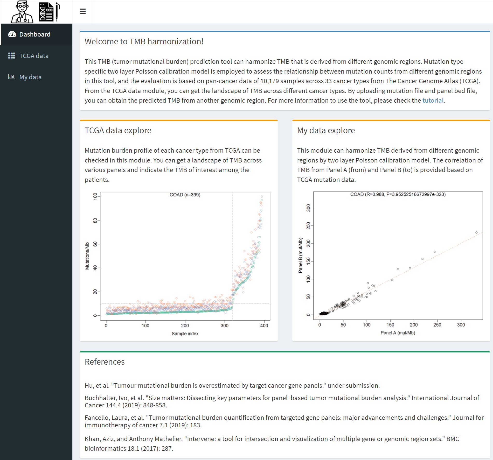

## TMB prediction App

## Introduction

This TMB (tumor mutational burden) prediction tool can harmonize TMB that is derived from different genomic regions. Linear regression model is employed to assess the relationship between mutation counts from different genomic regions in this tool, and the evaluation is based on pan-cancer data of 10,179 samples across 33 cancer types from The Cancer Genome Atlas (TCGA). From the TCGA data module, you can get the landscape of TMB across different cancer types. By uploading mutation file and panel bed file, you can obtain the predicted TMB from another genomic region.  
 

## TCGA data module

Mutation burden of each cancer type from TCGA pan-cancer data can be checked in this module. You can get a landscape of TMB across various panels. The region of WES (whole exome sequencing) is defined as all coding regions that are obtained from UCSC table browser. The region of MSK (MSK-IMPACT) and F1CDX (FoundationOne CDx) are defined as coding regions of the genes that are officially released. Please note that the default y-axis limit is 100 mut/Mb, and it can be tuned as required. You also can input a TMB value of interest to see where it is among all the samples. 

## My data module

VCF (variant call format) format is accepted for the input mutation data. For the input panel region data, BED (Browser Extensible Data) format is accepted and should at least include three columns: chromosome, start position and end position. The coordinate is 0-based. After uploading required files, the correlation of TMB from Panel A (from) and Panel B (to) is provided and the adjusted TMB is reported.

## Availability

The app is available at: https://cancergenomics-explore.shinyapps.io/shiny_tmb/

## Note

The stand-alone R package can be downloaded at: https://github.com/jasonwong-lab/TMB/tree/master

